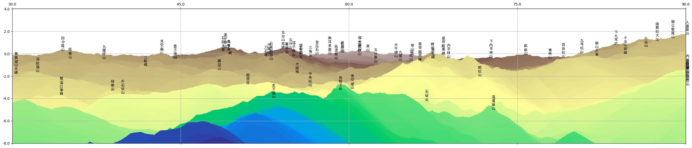

# terrain-viewer

Plots virtual terrain views with mountain names.

## Introduction

When hiking, people see mountains and wonder what the mountain names are. Given a user's location (latitude and longitude) as input, this program plots the virtual terrain view the user sees and tags the virtual mountains with their names, so that the user can tell the mountain names by comparing the real view to the virtual view. The program works only in Northern Taiwan currently. It can be generalized to other areas if modified appropriately.

For example, given the location <24.9748287, 121.6303675>, the program generates the image
  
which matches the real view at the location [(see it on Google map)](https://www.google.com/maps/@24.9748832,121.6303363,3a,34.3y,66.72h,90.01t/data=!3m8!1e1!3m6!1sAF1QipO1yJJ2Cv-bhhTro_-UCMK1qqwc12LhAWMnmi3i!2e10!3e11!6s%2F%2Flh5.ggpht.com%2Fp%2FAF1QipO1yJJ2Cv-bhhTro_-UCMK1qqwc12LhAWMnmi3i%3Dw900-h600-k-no-pi-0.013638287717270714-ya5.721627826474418-ro0-fo100!7i8704!8i4352?coh=205410&entry=ttu&g_ep=EgoyMDI0MTAyOS4wIKXMDSoASAFQAw%3D%3D).

## Data

This program requires two data sources, digital elevation model (DEM) and mountain names. DEM can be download from [Taiwan gonverment's website](https://data.gov.tw/dataset/35430
). Mountain names can be retrieved from https://overpass-turbo.eu/ with the following query.  

    [out:json][timeout:25];
    {{geocodeArea:Taiwan}}->.searchArea;
    (
        node["natural"="peak"](area.searchArea);
    );
    out body;
    >;
    out skel qt;
